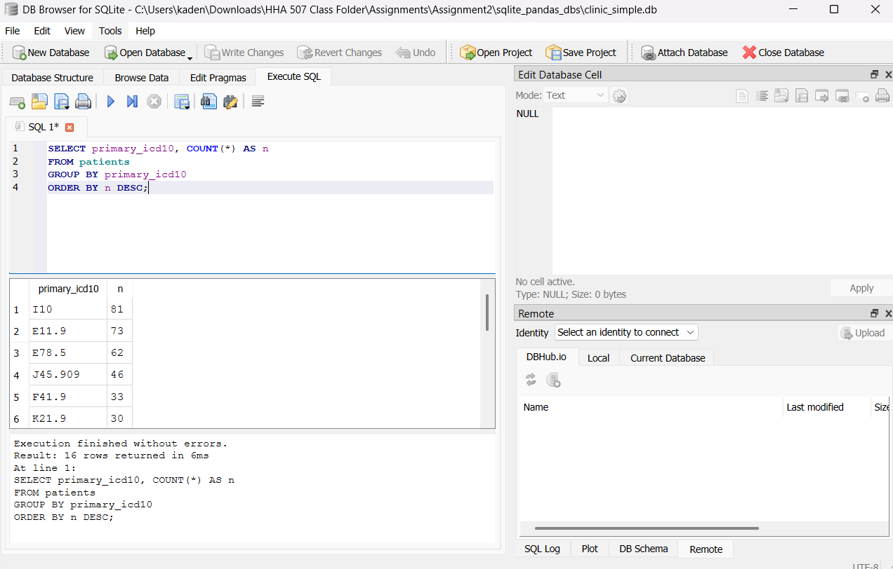
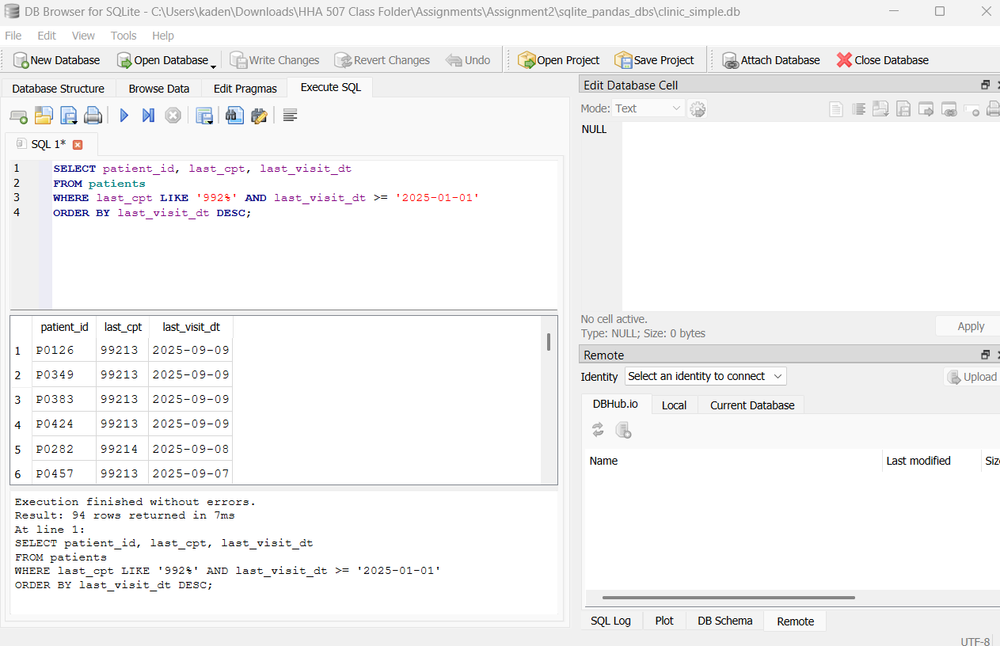
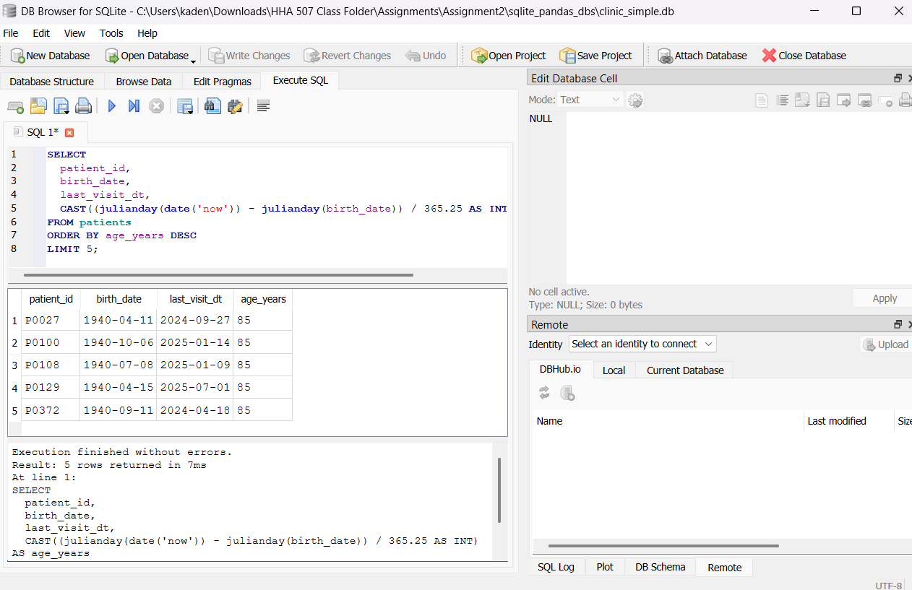
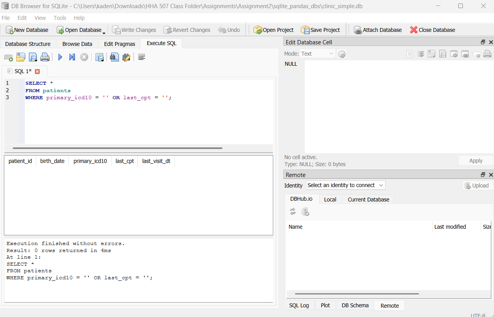

# HHA 507 Assignment 2: Single-Table Patient Roster in SQLite
- Name: Blanca Chimborazo-Reyes
- In this assignment, I created a SQLite database from a schema using Python. I imported data from a CSV file (patients.csv) and executed SQL queries to examine various aspects of the data, including diagnoses and procedure codes.

## How To Recreate the Database
- Install dependencies
   ```bash
   pip install -r requirements.txt
   ```
- Create the database: Create clinic_simple.db and apply the schema from sql/schema.sql.
```bash
   python src/create_db.py
   ```
- Load the CSV data: Import the data from data/patients.csv into the databse
 ```bash
   python src/import_csv.py
   ```
- Run Queries
    - Open clinic_simple.db in DB Broswer for SQLite
    - Go to the "Execute DQL" tab
    - Run queries from the sql/analysis.sql file

## Query Results
### Query A: Total Patient Count
- Query:

```bash
SELECT COUNT(*) AS n_patients FROM patients;
   ```
- Explanation: This query counts the total number of patients in the database. There are 500 total. 


### Query B: Top Primary Diagnoses
- Query:

```bash
SELECT primary_icd10, COUNT(*) AS n
FROM patients
GROUP BY primary_icd10
ORDER BY n DESC;
   ```
- Explanation: This query tallies the number of patients associated with each primary ICD-10 diagnosis code and sorts the results from most to least common. The results show that I10 is the most common, occuring 81 times. 



### Query C: Recent 
- Query:

```bash
SELECT patient_id, last_cpt, last_visit_dt
FROM patients
WHERE last_cpt LIKE '992%' AND last_visit_dt >= '2025-01-01'
ORDER BY last_visit_dt DESC;
   ```
- Explanation: This query searches for records where the "last_cpt" code starts with "992" and the "last_visit_dt" is on or after January 1st, 2025. Based on the results, 94 patients had visits in 2025.  



### Query D
- Query:

```bash
SELECT
  patient_id,
  birth_date,
  last_visit_dt,
  CAST((julianday(date('now')) - julianday(birth_date)) / 365.25 AS INT) AS age_years
FROM patients
ORDER BY age_years DESC
LIMIT 5;
   ```
- Explanation: This query calculates the patient's current age. The patient's age is calculated by subtracting the Julian date of birth from the current Julian date and divides that by 365.25. The results are ordered by age in descending order and are limited to the top 5 results only. The five oldest patients in the databse are 85 years old. 




### Query E
- Query:

```bash
SELECT *
FROM patients
WHERE primary_icd10 = '' OR last_cpt = '';
   ```
- Explanation: This query checks for any records with blank diagnosis or procedure codes. The results indicate that there are zero rows returned, meaning that every patient in the table has a value in the primary_icd10 and last_cpt fields.

