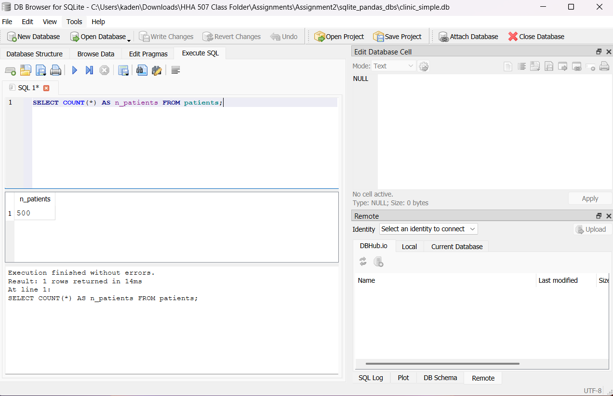

# HHA 504 Assignment 2: Single-Table Patient Roster in SQLite
- Name: Blanca Chimborazo-Reyes
- In this project I used Python to create a patient database in SQLite. I loaded patient data from the patients.csv file and ran SQL queries to analyze diagnoses, procedure codes etc. 

## How To Recreate the Database
- Install dependencies
   ```bash
   pip install -r requirements.txt
   ```
- Create the database: This creates the clinic-simple.db file and applies the schema from sql/schema.sql
```bash
   python src/create_db.py
   ```
- Load the CSV data: This imports the data from data/patients.csv into the databse
 ```bash
   python src/import_csv.py
   ```
- Run Queries
    - Open clinic_simple.db in DB Broswer for SQLite
    - Go to the "Execute DQL" tab
    - Run queries from sql/analysis.sql

## Query Results
- Query A: Total Patient Count
- Description: Count the total number of patients in the database
- Query: 
 ```bash
 SELECT COUNT(*) AS n_patients FROM patients;
    ```
- Results: The database contains 500 patient records total.

